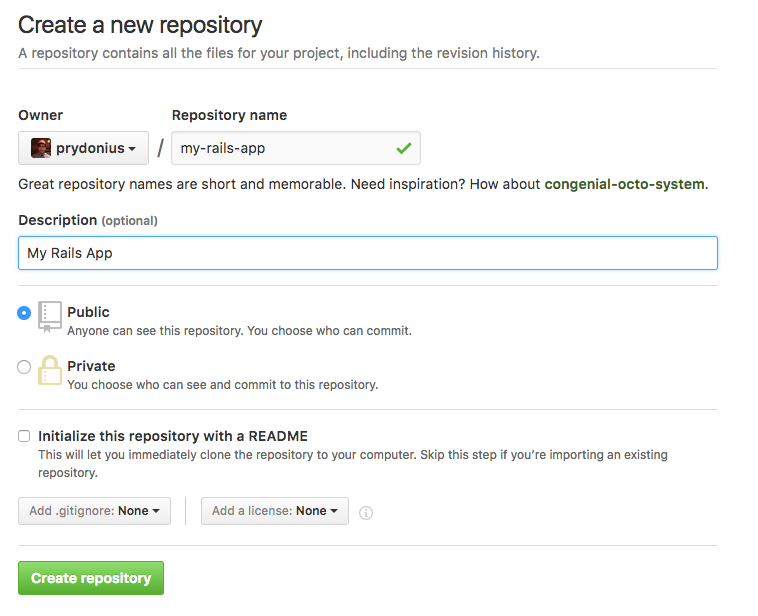

# Hands On: Development environments in seconds using Bitnami containers

Step-by-step guide of building a multi-tier Ruby on Rails application using a
Docker-based environment provided by Bitnami containers.

Optimized for making development in your framework of choice easy and fun,
Bitnami Development Containers contain a complete environment all set up and
ready to go. Your framework of choice comes pre-installed, and comes configured
to work with the included infrastructure containers, such as a database.

## Getting started with Docker

### 1. Installing Docker

Head over to https://www.docker.com/products/docker to download a Docker for
Mac, Linux or Windows 10.

If you are using an older version of Windows, you can follow the steps to
[install Docker Toolbox](https://docs.bitnami.com/containers/how-to/install-docker-in-windows/).

### 2. Testing out your Docker installation

To test that Docker installed correctly, we'll try to run a simple web server.
Open up a terminal on your computer and run the following command:

```
docker info
docker-compose version
```

If the commands above work, Docker was correctly installed.
To start a webserver with Docker, run:

```
docker run -d -p 8080:80 --name webserver bitnami/nginx
```

Now in your web browser, go to http://localhost:8080/ and checkout your fancy new web server!

NOTE: If you are using Docker Toolbox for Windows, you need to find the Docker machine IP address first by running `docker-machine ip` instead, and replace localhost for the retrieved IP address.

To stop, and delete the web server, run the following command:

```
docker stop webserver
docker rm -v webserver
```

If you refresh the browser, you should see that the web server is no longer there.

## Bring up the Bitnami Ruby on Rails environment

### 1. Getting started

To get all the tools you need to start building your Ruby on Rails application,
all you need to do is download the Docker Compose orchestration file to provision your environment.

First, create a new directory to keep your code in:

```
mkdir myrailsapp
cd myrailsapp
```

Next, download the `docker-compose.yml` orchestration file and save it in the folder you created:

```
curl -L "https://raw.githubusercontent.com/bitnami/bitnami-docker-rails/master/docker-compose.yml" > docker-compose.yml
```

### 2. Bringing it up

Finally, use the `docker-compose` to bring up the environment.

```
docker-compose up
```

This command will download the containers and start creating your new Rails application.

### 3. Inspecting the docker-compose.yml file

Whilst you're waiting, you can take a look at the `docker-compose.yml` file.

```
version: '2'

services:
  mariadb:
    image: bitnami/mariadb:latest

  myapp:
    tty: true # Enables debugging capabilities when attached to this container.
    image: bitnami/rails:latest
    environment:
      - DATABASE_URL=mysql2://mariadb/my_app_development
    depends_on:
      - mariadb
    ports:
      - 3000:3000
    volumes:
      - .:/app
```

In the file, there are two services defined.
The first is MariaDB, a popular database that we will use as the storage backend for our Rails application.

The second is the Bitnami Rails container itself, which will run the Rails server on port 3000.
In the definition, we're telling the Rails container where to look for the database, and also mounting the current directory so the container can use our code.

### 4. Accessing the application

You'll notice that your project directory now contains the source code for a Ruby on Rails application.
Later on, we'll start editing our app, but first let's try to access it.

Once the Rails server has started, you should be able to access your application by pointing your browser to http://localhost:3000/.


## Sharing your enviroment on GitHub

Sharing your environment with other people in your team is really easy with your new development environment.
We'll use Git and GitHub to host and share your source code.

### 1. Install Git

You will need Git installed before continuing with this section.
Visit https://git-scm.com/downloads to download and install the latest version of Git.

Once you've installed Git, setup the name and email you want your commits to be associated with:

```
git config --global user.name "YOUR NAME"
git config --global user.email "YOUR EMAIL ADDRESS"
```

### 2. Create a repository on GitHub

Go to https://github.com and create an account or login to an existing one.
Once you are logged in, click on 'New repository' on the homepage to create a new repository for your code.

Fill in the name and description for your repository and click 'Create repository'.



### 3. Initialize and push your code to GitHub

To initialize the repository on your computer, run the following commands in your project directory:

```
git init
git add .
git commit -m "first commit"
```

Now that we've initialized our Git repository, we can push our code to our GitHub repository.
To do this, copy the instructions for pushing an existing repository from the command line from the GitHub repository page, for example:

```
git remote add origin git@github.com:prydonius/my-rails-app.git
git push -u origin master
```

Refresh GitHub and you'll see that your Rails application, and the `docker-compose.yml` environment is now being shared on GitHub!


### 4. Share with your team to get the same environment

Now that your source code is on GitHub, other members on your team can run and develop your app with two commands:

```
git clone git@github.com:<username>/<repo name>.git
docker-compose up
```

## Developing your application

In order to demonstrate how you can use your Docker-based development environment, we will create a sample blog application using Rails.

### 1. Setting up the blog

In order to create our blogging application, we will tell Rails to create a model for storing our post data.
In Rails, you can do this by creating a scaffold for a post model, which will create the table in the database, and create views and routes for us to list, create and delete posts.

To do this, Rails provides the [`rails` command line utility](http://guides.rubyonrails.org/command_line.html) which we can run inside the container:

```
docker-compose exec myapp rails scaffold post title:string content:text
docker-compose exec myapp rake db:migrate
```

After running these commands, visit [http://localhost:3000/posts](http://localhost:3000/posts) to see the home page for our blog.
The Rails server is designed to automatically reload when models, views and controllers are changed, so we didn't need to do anything for it to pick up our changes!

### 2. Creating some posts

Let's start creating some posts so our blog doesn't look really empty.
Click on 'New Post' and fill in some titles and content to create posts.

After creating your first post, you will be able to see your post on our blog page [http://localhost:3000/posts](http://localhost:3000/posts)!


### 3. Making it look more like a blog

Although we can view, create and delete posts, our blog doesn't really look like a blog right now.
We're going to improve the look and feel of our blog by adding the [Material Design CSS framework](https://github.com/cllns/material_design_lite-rails) to our application and updating the CSS and HTML.

#### 3.1. Adding Material Design as a dependency to our application

Sometimes we need to add third-party dependencies to our applications, for adding extra functionality.
Rails manages dependencies, known as gems, in the Gemfile.

To add Material Design to our Rails app, edit the Gemfile to add the following line at the end:

```
gem 'material_design_lite-rails', '~> 1.2'
```

For our environment to download and setup the dependency, we need to restart our containers:

```
docker-compose stop
docker-compose up
```

When the container restarted, it picked up the change and installed our new dependency.

#### 3.2. Updating CSS and HTML

Now that we've added the Material Design dependency, we can update the HTML and CSS to improve the design of our blog.
In your editor, open `app/assets/stylesheets/application.css` and replace it with the following:

```css
/*
 *= require material
 */

body {
  background-color: #FAFAFA;
  padding: 20px;
}

.demo-card-wide {
  width: 80%;
  margin: 10px auto;
}

.clearfix {
  clear: both;
  text-align: center;
}
```

Next, open `app/views/posts/index.html.erb` and replace it with the following:

```html
<p id="notice"><%= notice %></p>

<h1>Posts</h1>
<% @posts.each do |post| %>
  <div class="demo-card-wide mdl-card mdl-shadow--2dp">
    <div class="mdl-card__title">
      <h2 class="mdl-card__title-text"><%= post.title %></h2>
    </div>
    <div class="mdl-card__supporting-text">
      <%= post.content %>
    </div>
    <div class="mdl-card__actions mdl-card--border">
      <%= link_to 'Show', post, class: 'mdl-button mdl-button--colored mdl-js-button mdl-js-ripple-effect' %></td>
      <%= link_to 'Edit', edit_post_path(post), class: 'mdl-button mdl-button--colored mdl-js-button mdl-js-ripple-effect'%></td>
      <%= link_to 'Destroy', post, method: :delete, data: { confirm: 'Are you sure?' }, class: 'mdl-button mdl-button--colored mdl-js-button mdl-js-ripple-effect' %>
    </div>
  </div>
<% end %>

<div class='clearfix'>
  <%= link_to 'New Post', new_post_path, class:"mdl-button mdl-js-button mdl-button--raised mdl-button--colored" %>
</div>
```

Once again, since the Rails server automatically reloads when CSS or HTML is changed, we can simply reload to see the changes we've made to our blog.


## Wrapping up

From getting up and running, sharing your application, and making changes, we've seen how easy it is to get started with developing a Ruby on Rails application using Bitnami's Docker-based development environments.

We've shown you how you can:
- Get the Docker Compose file to orchestrate your multi-tier application using containers
- Run framework tools inside the containers to bootstrap your application
- Manage, install and use dependencies in your application
- Develop and see the changes in your application

Ruby on Rails was used as an example of a framework for developing an application, however Bitnami provides Docker-based development environments for a range of different runtimes and frameworks:
- [Express](https://github.com/bitnami/bitnami-docker-express)
- [Laravel](https://github.com/bitnami/bitnami-docker-laravel)
- [Symfony](https://github.com/bitnami/bitnami-docker-symfony)
- [CodeIgniter](https://github.com/bitnami/bitnami-docker-codeigniter)
- [Play](https://github.com/bitnami/bitnami-docker-java-play)
- [Swift](https://github.com/bitnami/bitnami-docker-swift)
